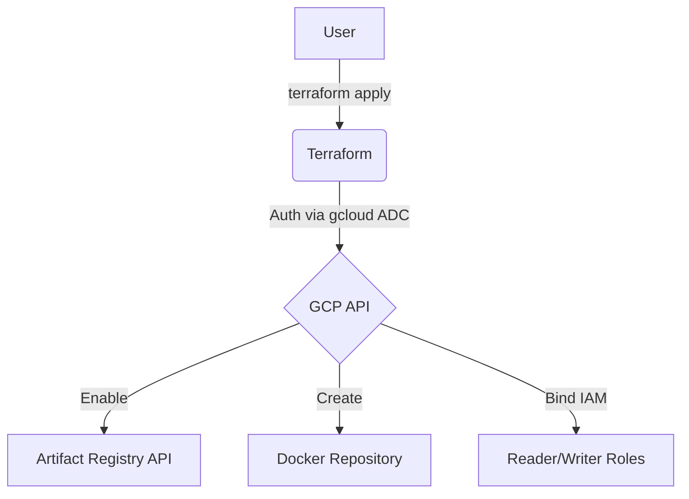
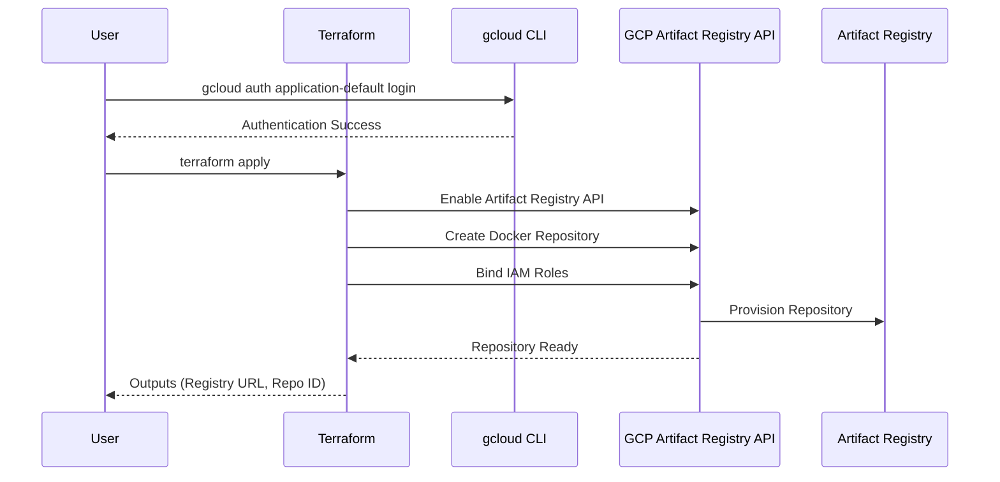

# terraform-gcp-artifact-registry

This Terraform project provisions a Google Artifact Registry Docker repository for storing and managing container images.

## Architecture

### Flowchart


### Sequence Diagram


## Repository Specifications
- **Format**: `DOCKER` (container images).
- **Regions**: `us-west1`, `us-central1`, or `us-east1`.
- **IAM**: Granular reader/writer roles for users and service accounts.

## Prerequisites
1.  **Google Cloud SDK**: [Installed and initialized](https://cloud.google.com/sdk/docs/install).
2.  **Terraform**: [Installed](https://developer.hashicorp.com/terraform/downloads).
3.  **Container CLI**: [Docker](https://docs.docker.com/get-docker/) or [Podman](https://podman.io/docs/installation).

## Setup & Deployment

1.  **Authenticate and Select Project**:
    Instead of using a service account JSON file, this project uses your local `gcloud` credentials.
    ```bash
    # Authenticate
    gcloud auth application-default login

    # Select your project
    gcloud config set project your-project-id
    ```

2.  **Configure Variables**:
    Create a `terraform.tfvars` file based on the example:
    ```hcl
    project_id       = "your-project-id"
    region           = "us-central1"
    repository_id    = "docker-repo"
    description      = "Docker repository for storing container images"
    reader_members   = ["user:your-email@example.com"]
    writer_members   = ["user:your-email@example.com"]
    ```

3.  **Deploy**:
    ```bash
    terraform init
    terraform apply
    ```

4.  **Important: Configure Registry Auth**:
    After deployment, authenticate your container CLI to use your gcloud credentials.

    **Docker**:
    ```bash
    gcloud auth configure-docker us-central1-docker.pkg.dev
    ```

    **Podman** (option A — using gcloud access token):
    ```bash
    gcloud auth print-access-token | podman login -u oauth2accesstoken --password-stdin us-central1-docker.pkg.dev
    ```

    **Podman** (option B — using service account JSON key):
    ```bash
    podman login -u _json_key --password-stdin us-central1-docker.pkg.dev < path/to/key.json
    ```

5.  **Publish an Image**:
    **Docker**:
    ```bash
    # Build your image
    docker build -t my-app .

    # Tag for Artifact Registry (use the docker_registry_url from outputs)
    docker tag my-app us-central1-docker.pkg.dev/your-project-id/docker-repo-XXXX/my-app:latest

    # Push the image
    docker push us-central1-docker.pkg.dev/your-project-id/docker-repo-XXXX/my-app:latest
    ```

    **Podman**:
    ```bash
    # Build your image
    podman build -t my-app .

    # Tag for Artifact Registry
    podman tag my-app us-central1-docker.pkg.dev/your-project-id/docker-repo-XXXX/my-app:latest

    # Push the image
    podman push us-central1-docker.pkg.dev/your-project-id/docker-repo-XXXX/my-app:latest
    ```

6.  **Pull and Use the Image**:
    Any GCP service with `roles/artifactregistry.reader` (e.g. Cloud Run, GKE, Compute Engine) can pull the image:
    ```bash
    docker pull us-central1-docker.pkg.dev/your-project-id/docker-repo-XXXX/my-app:latest
    ```
    Or with Podman:
    ```bash
    podman pull us-central1-docker.pkg.dev/your-project-id/docker-repo-XXXX/my-app:latest
    ```

## Usage as a Module

Reference this repository as a Terraform module in your own configurations:

> **Option 1**: Terraform Registry (recommended)
> ```hcl
> module "artifact-registry" {
>   source  = "marcuwynu23/artifact-registry/gcp"
>   version = "1.0.0"
>
>   project_id     = var.project_id
>   region         = "us-central1"
>   repository_id  = "my-app-repo"
>   writer_members = ["user:writer@example.com"]
>   reader_members = ["user:reader@example.com"]
> }
> ```
>
> **Option 2**: GitHub source
> ```hcl
> module "artifact-registry" {
>   source = "github.com/marcuwynu23/terraform-gcp-artifact-registry?ref=main"
>
>   project_id     = var.project_id
>   region         = "us-central1"
>   repository_id  = "my-app-repo"
>   writer_members = ["user:writer@example.com"]
>   reader_members = ["user:reader@example.com"]
> }
> ```

Then use the outputs to get the registry URL:
```hcl
output "registry_url" {
  value = module.artifact-registry.docker_registry_url
}
```

## Variables

| Variable | Description | Type | Default |
|----------|-------------|------|---------|
| `project_id` | GCP project ID | `string` | (required) |
| `region` | GCP region (free tier: us-west1, us-central1, us-east1) | `string` | `"us-central1"` |
| `repository_id` | Base ID of the repository (random suffix appended) | `string` | `"docker-repo"` |
| `description` | Description of the repository | `string` | `"Docker repository for storing container images"` |
| `reader_members` | List of members with read access | `list(string)` | `[]` |
| `writer_members` | List of members with write access | `list(string)` | `[]` |

## Outputs

| Output | Description |
|--------|-------------|
| `repository_id` | The ID of the created repository |
| `repository_name` | The full resource name of the repository |
| `docker_registry_url` | The Docker registry URL for push/pull |
| `registry_location` | The region of the repository |

## Resources Created

- `random_id.suffix` – Random suffix for unique repository naming
- `google_project_service.artifactregistry_api` – Enables Artifact Registry API
- `google_artifact_registry_repository.docker_repo` – Docker repository in Artifact Registry
- `google_artifact_registry_repository_iam_member.read_access` – IAM binding for readers
- `google_artifact_registry_repository_iam_member.write_access` – IAM binding for writers
## CI/CD Setup (GitHub Actions)

### Prerequisites
1. **Create a GCS bucket** for Terraform remote state:
    ```bash
    gcloud storage buckets create gs://your-terraform-state-bucket \
      --location=us-central1 \
      --uniform-bucket-level-access
    ```

2. **Create a service account** with necessary permissions and generate a JSON key:
    - GCP Console → IAM & Admin → Service Accounts → Create Service Account
    - Grant the required roles for this module
    - Keys → Add Key → Create New Key → JSON
    - Copy the entire JSON file contents

3. **Add GitHub secrets**:

    | Secret Name | Value |
    |---|---|
    | `GCP_SA_KEY` | Full JSON key from step 2 |
    | `TF_BUCKET_NAME` | Your GCS bucket name |
    | `TF_BUCKET_PREFIX` | Bucket prefix/path (e.g., `gcp-artifact-registry`) |

4. **Run the workflow**:
    - **Apply**: Go to Actions → **CD - GCP Artifact Registry (Apply)** → fill in all inputs
    - **Destroy**: Go to Actions → **CD - GCP Artifact Registry (Destroy)** → fill in essential inputs

> Alternatively, create a `backend.tfvars` from `backend.tfvars.example` and run `terraform init -backend-config="backend.tfvars"` for local use.

## Remote State (GCS Backend)

This module uses Google Cloud Storage (GCS) as the Terraform backend for remote state management:

```hcl
terraform {
  backend "gcs" {
    bucket = "your-terraform-state-bucket"
    prefix = "gcp-artifact-registry"
  }
}
```

Create a `backend.tfvars` file based on `backend.tfvars.example` and initialize:

```bash
terraform init -backend-config="backend.tfvars"
```

